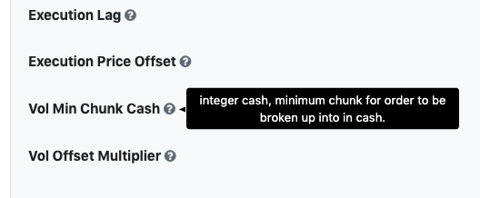
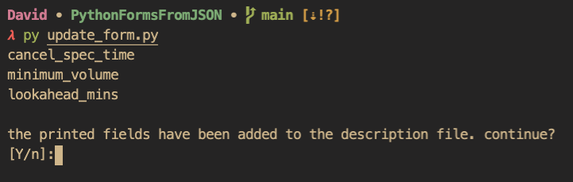

# Table Of Contents

1. [Use Case](#use-case)
2. [Implementation](#implementation)
3. [How to Change the Form](#how-to-change-the-form)
4. [ToolTips](#tooltips)
5. [Submitting and Downloading The New Configuration](#submitting-and-downloading-the-new-configuration)


## Use Case

I was working on a algorithmic trading backtester in Python and wanted to create a user friendly way to edit backtesting settings — which I was keeping in a json file. At the time, I didn't know Javascript and the barrier of learning the language seemed too high for this one use. So

## Implementation

There is a javascript package called <a href="https://github.com/formio/formio" target="_blank">Formio</a> which is excellent for this very purpose. It is a javascript library that will take a javascript object with form specific entries and produce a form in html. 

So, in order to take my configuration file (which is called `config/config.json` in the repo) and translate that into a form, the steps are as follows:

1. Import json in python.
2. Create new json object (dictionary) which includes each configuration entry
3. Convert the json dictionary to text and insert it into the `config_form.html` file.

In the end, the result is a file (`config_form.html`) which includes its own bootrap css and formio javascript. 

You can see an example <a href="https://rawcdn.githack.com/dcorso21/PythonFormsFromJSON/b28b802a4fa35e71d7dea34ed22b2738114a512f/config_form.html" target="_blank">here</a>.

## How to Change The Form

In order to change the contents of the form, you simply need to add a category to the `config/config.json`. You can also change the value in any field in the `config/config.json` file and it will save the value as the default in the form. If you run `python update_form.py` in terminal and there are new config fields, you will see a warning about there being new fields in the `config/config_descriptions.json` file. See [Tooltips](#tooltips) below for more info.   

## ToolTips

You will also notice in the <a href="https://rawcdn.githack.com/dcorso21/PythonFormsFromJSON/b28b802a4fa35e71d7dea34ed22b2738114a512f/config_form.html" target="_blank">example</a> that most fields have tool tip question mark symbols beside their field names. When you hover over you will see the descriptions saved in the `config/config_descriptions.json`. When you run the `update_form.py` file, it will warn you in the console if there are fields that dont have descriptions. When this message comes up, the fields in the `config/config_descriptions.json` will actually be created automatically. So if you create a new configuration setting, just run the `python update_form.py` in the console and it will copy the fields over to the description file. 



When you run the `update_form.py` file, it will warn you in the console if there are fields that dont have descriptions. When this message comes up, the fields in the `config/config_descriptions.json` will actually be created automatically. So if you create a new configuration setting, just run the `python update_form.py` in the console and it will copy the fields over to the description file. 

Once those entries have been created, you will be asked if you would like to continue creating the form or not (Y/N?) If you press N, the program will end without updating the html file and you will have the opportunity to go back and fill in the description field.



## Submitting and Downloading The New Configuration

When you visit the <a href="https://rawcdn.githack.com/dcorso21/PythonFormsFromJSON/b28b802a4fa35e71d7dea34ed22b2738114a512f/config_form.html" target="_blank">form page</a> you will notice that there is a submit button at the bottom. The only field required for submitting the form is the form title at the top. Once you have edited the settings to your liking, you can hit the submit which will download a new JSON file with the name given in the title field. The download location is dependent upon the user's browser settings, but the default on a mac and PC is the downloads folders (although they obviously have different absolute paths. 

An extra feature that I have included in the `update_form.py` file is moving all of the config files to the repository's directory in the `config/saved_configurations` folder. The current setup works with the mac downloads folder structure, but you can easily change the directory of the downloaded files in the `update_form.py` file. See lines 8 and 9 below:

```python
# If on a PC, this directory may need to be edited to fit your download location. 
DOWNLOADS_PATH = Path.home() / "Downloads"
```

The `Path` Object is imported from `pathlib` at the top of the document. Whatever you set the value to, ensure that it is a POSIXPATH object. 
